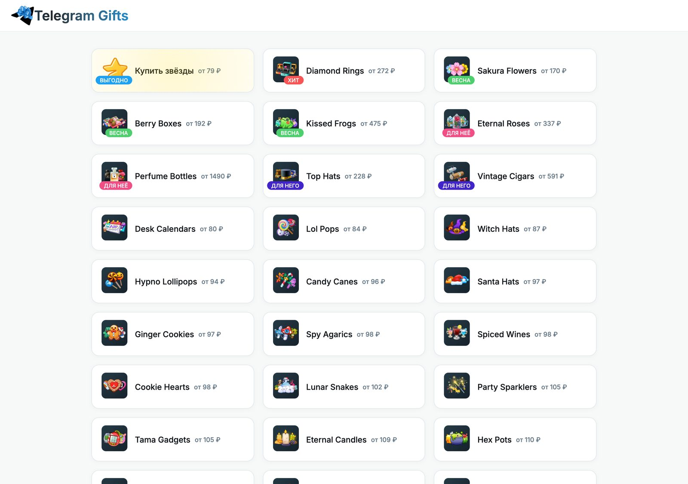

# Tgift

Магазин коллекционных Telegram Gifts. Сайт на Django: витрина коллекций, карточки NFT с GetGems, оплата через WATA, рефералка и отзывы.

Работал в период хайпа на подарки Telegram. Сейчас это архив кода: без боевой базы, ключей и живого домена.

<p align="center">
  
</p>

<p align="center"><em>Главная: коллекции, бейджи, цена «от … ₽». Скрин с локального запуска по сохранённому каталогу.</em></p>

## Что умеет

- каталог коллекций и лотов
- парсеры GetGems (Playwright) и курса валют
- кэш в SQLite
- оплата через WATA
- реферальные ссылки и простая статистика визитов
- уведомления в Telegram о заказах
- админка Django

## Стек

Django, BeautifulSoup, Playwright, WATA, ScrapingBee, SQLite.

## Запуск

```bash
python3 -m venv .venv
source .venv/bin/activate
pip install -r requirements.txt
cp .env.example .env
python3 manage.py migrate
python3 manage.py runserver
```

Витрина читает `parsed_data.json` (в git его нет — его пишут парсеры). Без этого файла главная откроется, но коллекции будут пустые.

Парсеры (`gifts_parser.py`, `collections_parser.py`, `currency_parser.py`) отдельно заливают данные на `SERVER_URL`.

## Переменные окружения

Смотри `.env.example`. Ключи платежей и бота только оттуда: `WATA_API_KEY`, `SCRAPINGBEE_API_KEY`, `TELEGRAM_BOT_TOKEN`.

`SITE_URL` нужен для return/fail URL платёжки. По умолчанию `http://127.0.0.1:8000`.
